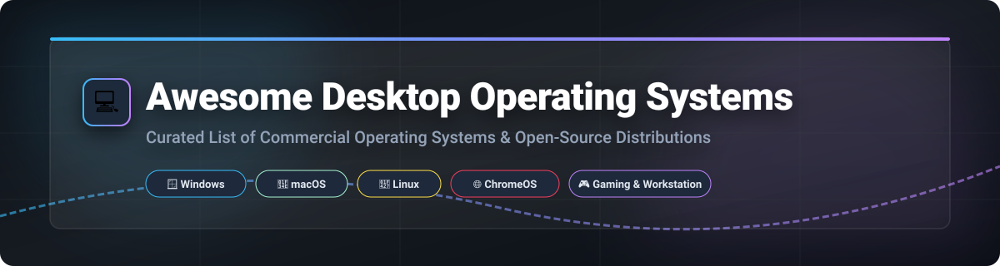

  
  
  
  
  
  

  

# 💻 Awesome Desktop Operating System

> **A curated, comprehensive guide to commercial operating systems and open-source Linux distributions for desktop computing, gaming, productivity, and workstation workflows.** 🚀

---

## 📌 Overview & SEO Summary

Whether you are looking for **high-performance gaming OS**, **rock-solid developer workstations**, **lightweight distributions for older hardware**, or **privacy-focused commercial alternatives**, this repository provides an authoritative overview of desktop operating systems.

### 🌟 Key Highlights
- 🪟 **Commercial Giants**: Detailed pricing, free tier limitations, market shares, and corporate valuation.
- 🐧 **Open-Source Powerhouses**: Sorted by real GitHub star popularity, community engagement, and distro rankings.
- 🎮 **Specialized OS**: Gaming-ready distros with pre-configured Steam/Proton support (Bazzite, CachyOS, Pop!_OS).
- 🛡️ **Immutable & Atomic OS**: Modern container-first & unbreakable systems (Fedora Silverblue, NixOS).

---

## 📖 Table of Contents
- [💼 Commercial & SaaS Desktop Operating Systems](#-commercial--saas-desktop-operating-systems)
- [🔓 Open-Source Desktop Distributions](#-open-source-desktop-distributions)
- [🤝 How to Contribute](#-how-to-contribute)
- [📈 Star History](#-star-history)
- [💖 Support & Sponsorship](#-support--sponsorship)
- [⚠️ Disclaimer](#-disclaimer)

---

## 💼 Commercial & SaaS Desktop Operating Systems

> **📈 Estimated Sector Market Size & Concentration**: The global desktop operating system market size is estimated at **$54.8 Billion** and is **highly concentrated** (winner-take-all dynamics dominated by Microsoft Windows and Apple macOS holding over 90% combined global market share).

| 🖥️ Operating System | 📝 Description | 💵 Pricing | 🎁 Free Tier Limits | 📊 Market Share | 🏢 Company Size (Valuation / Revenue) |
| :--- | :--- | :--- | :--- | :--- | :--- |
| **[macOS Sonoma (14)](https://www.apple.com/macos/sonoma/)** 🍎 | **Apple's flagship desktop OS.** Premium Unix-based UI, Safari profiles, Game Mode, metal graphics API, and Apple Silicon hardware acceleration. | **$0** (Bundled with Mac hardware; standalone Mac mini starts at $599) | **Free perpetual updates** for Mac owners; requires genuine Apple Mac hardware or official virtualization. | **~16.37%** (macOS + OS X combined) | **~$3.4 Trillion Valuation** (~$400B annual revenue) |
| **[Windows 11](https://www.microsoft.com/en-us/windows/windows-11)** 🪟 | **Microsoft's flagship commercial OS.** Modern centered taskbar, DirectStorage for gaming, Android app support via WSA, and Microsoft 365 Copilot AI. | **$139.99** (Home Edition) / **$199.99** (Pro Edition); Free upgrade for eligible Windows 10 PCs. | **Unactivated trial** available indefinitely with a subtle desktop watermark and disabled personalization settings. | **~56.55%** (Global leader) | **~$3.1 Trillion Valuation** (~$281B annual revenue) |
| **[Windows 10](https://www.microsoft.com/en-us/windows/windows-10)** 💻 | **Legacy Microsoft OS.** Reached End of Support (EOS) on October 14, 2025. Still used across enterprise legacy systems. | **End of Support** (Base OS); Extended Security Updates (ESU) cost **$61/device/year** for Year 1. | **End of Support** — No free updates for Home/Pro; standard consumer free tier discontinued. | **Legacy** (~35% declining share) | **~$3.1 Trillion Valuation** (~$281B annual revenue) |
| **[ChromeOS](https://www.google.com/chromebook/)** 🌐 | **Google's cloud-centric OS.** Linux kernel with Chrome browser UI, Google Play Android app integration, and Crostini Linux container support. | **$0** (Pre-installed on Chromebooks starting at $199; ChromeOS Flex ISO download is $0). | **Free perpetual OS** pre-installed on certified Chromebook hardware or free bootable ChromeOS Flex download. | **~1.21%** (Global share) | **~$2.2 Trillion Valuation** (~$350B annual revenue) |

---

## 🔓 Open-Source Desktop Distributions

Sorted by **GitHub Star Counts (Descending)** to reflect real developer and community adoption.

| 🐧 Distribution | 📝 Description | ⭐ GitHub Stars Badge | 🔧 Base Distro | 🖥️ Desktop Environment | 🎯 Best Used For |
| :--- | :--- | :---: | :--- | :--- | :--- |
| **[NixOS](https://nixos.org/)** ❄️ | **Declarative & Reproducible OS.** Purely functional package management with atomic system rollbacks. |  | Independent | GNOME, KDE Plasma, Hyprland | DevOps, Power Users, Reproducible Builds |
| **[Bazzite](https://bazzite.gg/)** 🎮 | **Next-gen Steam Deck-like gaming distro.** OCI-based immutable image powered by Universal Blue. |  | Fedora Atomic | KDE Plasma, GNOME, Steam Gaming UI | Gaming PCs, Handheld Consoles (Steam Deck) |
| **[Arch Linux](https://archlinux.org/)** 🏹 | **Lightweight & flexible DIY distro.** Rolling release model with access to the comprehensive Arch User Repository (AUR). |  | Independent | Custom / User choice | Power Users, Customization Enthusiasts |
| **[Linux Mint](https://linuxmint.com/)** 🌿 | **The ultimate Windows replacement.** Polished Cinnamon desktop, rock-solid stability, low hardware resource footprint. |  | Ubuntu LTS / Debian | Cinnamon, MATE, Xfce | Windows Converts, General Productivity |
| **[Pop!_OS](https://pop.system76.com/)** 🚀 | **System76's developer OS.** Out-of-the-box NVIDIA graphics support, auto-tiling COSMIC desktop, full disk encryption. |  | Ubuntu LTS | COSMIC (Rust-based), GNOME | Developers, AI Engineers, Gamers |
| **[elementary OS](https://elementary.io/)** 🎨 | **macOS-inspired open-source desktop.** Focus on beautiful aesthetic consistency, privacy, and curated AppCenter. |  | Ubuntu LTS | Pantheon | Designers, macOS Converts, Minimalists |
| **[openSUSE](https://www.opensuse.org/)** 🦎 | **Enterprise-grade open distribution.** Tumbleweed (rolling) and Leap (stable) editions with YaST control panel. |  | Independent | KDE Plasma, GNOME, Xfce | Enterprise Workstations, Sysadmins |
| **[Zorin OS](https://zorin.com/os/)** 💎 | **Designed for seamless Windows/Mac migration.** Pre-configured desktop layouts, Wine integration for Windows apps. |  | Ubuntu LTS | GNOME (Customized) | Newcomers, Education, Business |
| **[CachyOS](https://cachyos.org/)** ⚡ | **Performance-tuned Arch distribution.** Compiled with x86-64-v3/v4 CPU optimizations and custom kernel schedulers. |  | Arch Linux | KDE Plasma, GNOME, Hyprland | Hardcore Gamers, Benchmarking Enthusiasts |
| **[Debian](https://www.debian.org/)** 🌀 | **The universal operating system.** Renowned for rock-solid stability and massive software repositories. |  | Independent | GNOME, KDE, Xfce, LXQt | Servers, Stability Purists, Base Distro |
| **[Fedora Workstation](https://fedoraproject.org/workstation/)** 🎩 | **Innovator's Linux desktop.** Latest GNOME desktop, Wayland default, PipeWire audio, sponsored by Red Hat. |  | Independent | GNOME | Software Engineers, Cutting-Edge Users |
| **[Ubuntu Desktop](https://ubuntu.com/desktop)** 🟠 | **The world's most popular Linux desktop.** Corporate support from Canonical, 5-year LTS releases, wide OEM availability. |  | Debian | GNOME (Customized) | Beginners, Cloud Developers, Hardware Compatibility |
| **[Manjaro](https://manjaro.org/)** 📦 | **Approachable Arch Linux.** User-friendly installer, graphical package manager, delayed rolling releases for stability. |  | Arch Linux | KDE Plasma, GNOME, Xfce | Beginners entering Arch ecosystem |
| **[MX Linux](https://mxlinux.org/)** 🛠️ | **Midweight Debian distribution.** Top-ranked on DistroWatch, includes MX Tools helper suite and fast performance. |  | Debian Stable | Xfce, KDE Plasma, Fluxbox | Older Systems, Reliability Enthusiasts |
| **[Kubuntu](https://kubuntu.org/)** 🔹 | **Official Ubuntu flavor with KDE Plasma.** Windows-like start menu & panel layout backed by Ubuntu's software base. |  | Ubuntu LTS | KDE Plasma | Desktop Customization, Windows Converts |
| **[Fedora Silverblue](https://silverblue.fedoraproject.org/)** 🛡️ | **Atomic & Immutable desktop.** Immutable root filesystem with Flatpak application isolation and rpm-ostree updates. |  | Fedora | GNOME | Unbreakable Systems, Container Workflows |

---

## 🤝 How to Contribute

Contributions are welcome! Please follow these simple steps:
1. 🍴 **Fork** this repository.
2. 📝 **Add or update** entries in `README.md` following the tabular layout.
3. ⭐ Ensure open-source options include valid repository links and star badges.
4. 🔀 **Open a Pull Request** with a brief summary of your changes.

Check out [Awesome-Awesome-Awesome](https://github.com/ishandutta2007/Awesome-Awesome-Awesome) for more curated lists!

---

## 📈 Star History

---

## 💖 Support & Sponsorship

If you find this repository helpful for selecting your next operating system or setting up your workstation, please consider supporting the project!

- ⭐ **Star this repository** to increase its visibility.
- 🔀 **Fork & Share** it with your fellow Linux enthusiasts and colleagues.
- ☕ **Buy me a coffee / Sponsor**: Support ongoing maintenance on the [GitHub Sponsor Dashboard](https://github.com/sponsors/ishandutta2007).

Thank you for your support! 🙌

---

## ⚠️ Disclaimer

- This list is community-curated for informational purposes.
- Operating systems manage core security and personal data; always verify system image signatures and checksums before installation.
- All product names, logos, and brands are property of their respective owners.
